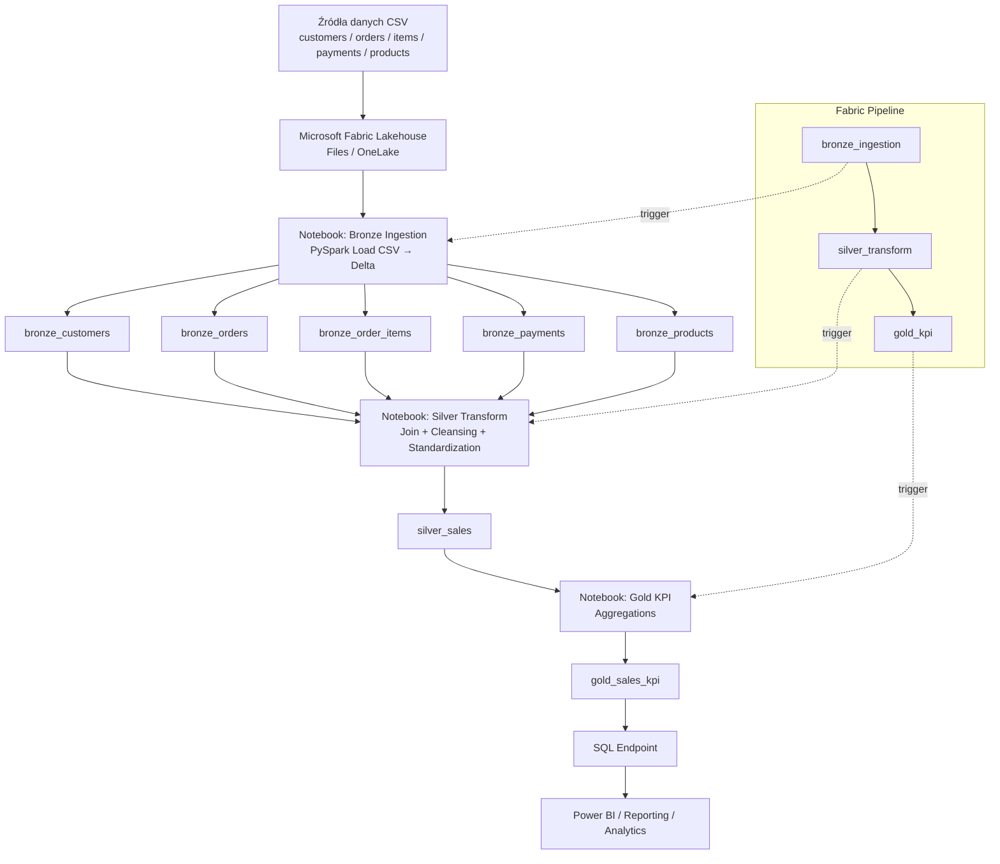
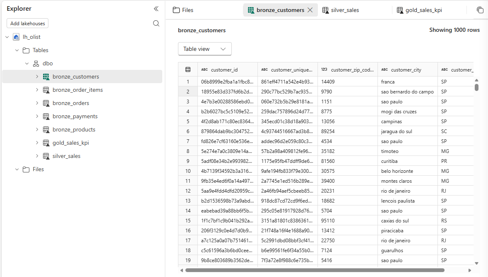
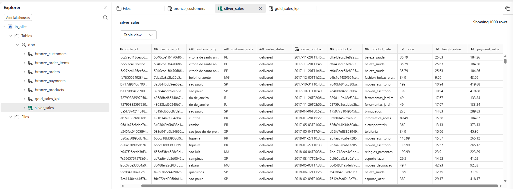
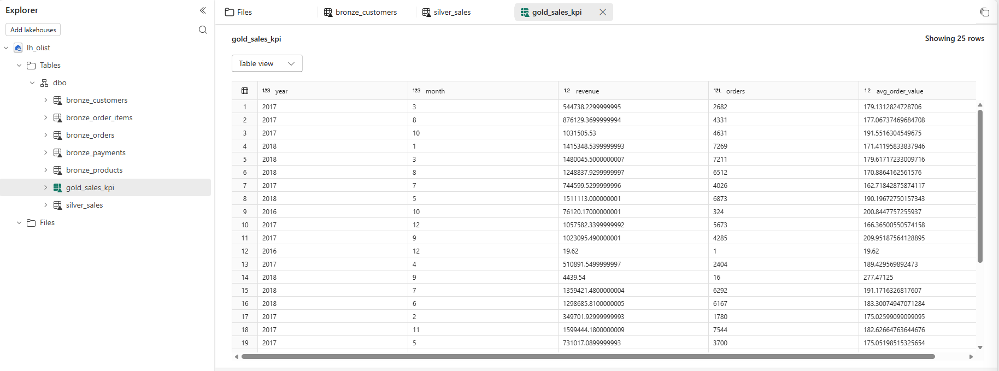
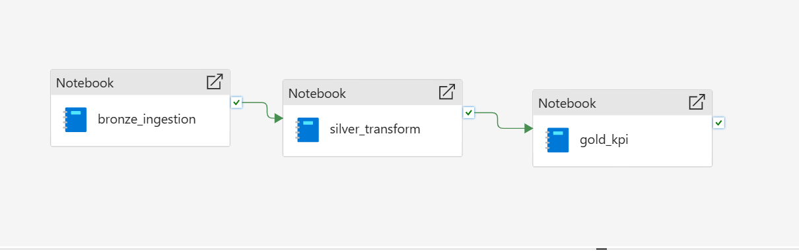

# OLIST Data Pipeline w Microsoft Fabric

## Opis projektu
Kompletny pipeline danych zbudowany w Microsoft Fabric z wykorzystaniem Lakehouse, Apache Spark oraz orkiestracji ETL.

Architektura oparta o model Medallion:
- Bronze
- Silver
- Gold

---

## Technologie
- Microsoft Fabric
- Lakehouse
- Apache Spark
- Notebooks
- Data Pipeline
- SQL Endpoint
- Delta Tables

---

## Architektura



---

## Struktura projektu

```text
olist-fabric-medallion/
├── data/
├── notebooks/
│   ├── nb_bronze_ingest.ipynb
│   ├── nb_silver_transform.ipynb
│   └── nb_gold_kpi.ipynb
├── screenshots/
│   ├── workspace.png
│   ├── bronze_tables.png
│   ├── silver_table.png
│   ├── gold_table.png
│   ├── pipeline.png
│   └── diagram.png
└── README.md
```

---

## Pipeline ETL

### 1. Bronze Layer
Import danych CSV do Lakehouse.

Tabele:
- bronze_customers
- bronze_orders
- bronze_order_items
- bronze_payments
- bronze_products



---

### 2. Silver Layer
Transformacje oraz join danych.

Tabela wynikowa:
- silver_sales



---

### 3. Gold Layer
Agregacje KPI.

Tabela wynikowa:
- gold_sales_kpi



---

## Orkiestracja

Pipeline uruchamia notebooki w kolejności:

1. bronze_ingestion
2. silver_transform
3. gold_kpi




---

## Efekt końcowy

Projekt prezentuje kompletny proces Data Engineering:

- ingest danych
- transformacje Spark
- model Medallion
- orkiestracja pipeline
- dane gotowe pod BI

---
